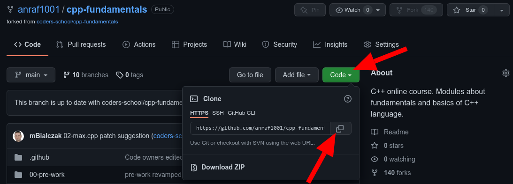

# Podstawowe użycie gita
## Sklonowanie repozytorium
Jeśli chcemy wprowadzić zmiany w repozytorium na naszym komputerze, w pierwszej kolejności musimy sklonować repozytorium (stworzyć jego lokalną kopię).
Do tego celu służy komenda:
```
git clone <link_do_repozytorium>
```
Link możemy odnaleźć klikają na zielony przycisk `Clone` na stronie głównej naszego repozytorium.


Po pobraniu repozytorium na nasz komputer, przechodzimy do folderu, w który się ono znajduje (nazwa folderu jest taka jak nazwa repozytorium). Przykład:
```
cd cpp-fundamentals/
```

## Wybranie odpowiedniej gałęzi
Chcąc wprowadzić zmiany w implementacji zadania domowego powinniśmy przełączyć się na odpowiednią dla tego niego gałąź.
Do zmiany gałęzi służy komenda:
```
git checkout <nazwa_gałęzi>
```
np. chcąc wprowadzić zmiany w zadaniu `fibonacci` powinniśmy przełączyć się na gałąź o tej samej nazwie:
```
git checkout fibonacci
```
Na wyjściu otrzymamy komunikat informujący nas na jaką gałąź się przełączyliśmy:
```
branch 'fibonacci' set up to track 'origin/fibonacci'.
Switched to a new branch 'fibonacci'
```

W każdym momencie możemy też sprawdzić aktualną gałąź korzystając z polecenia `git branch`.
Aktualna gałąź zostanie oznaczona za pomocą `*`.
```
* fibonacci
  main
```
Kolejnym sposobem jest wykorzystanie polecenia `git status`.
W odpowiedzi dostaniemy informację o aktualnej gałęzi, ale także czy nasza lokalna gałąź jest aktualna ze swoim odpowiednikiem na GitHubie oraz czy zostały wprowadzone niezatwierdzone jeszcze zmiany.
```
On branch fibonacci
Your branch is up to date with 'origin/fibonacci'.

nothing to commit, working tree clean
```
